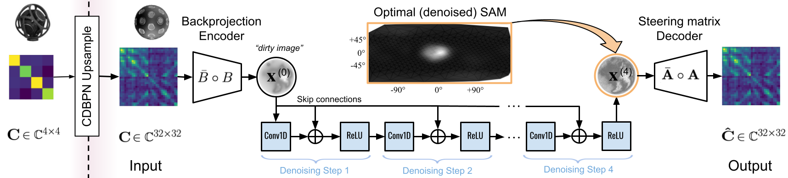

# Latent Acoustic Mapping for Direction of Arrival Estimation: A Self-Supervised Approach

[](https://arxiv.org/abs/2507.07066)
[](https://www.linux.org/)
[](https://www.python.org/)
[](https://creativecommons.org/licenses/by/4.0/)

<p align="center">
  
</p>

## Installation

See [installation instructions](docs/INSTALL.md).

## Datasets

| Dataset     | Format | Type | URL                                                                                 |
|-------------|-------------|-----------|-------------------------------------------------------------------------------------|
| EigenScape | em32 | real | [Link](https://zenodo.org/records/1012809) |
| STARSS23 | mic & em32 | real | [Link](https://zenodo.org/records/7880637)|
| LOCATA | em32 | real | [Link](https://zenodo.org/records/3630471) |
| SpatialScaper Simulated Audio | mic & em32 | synthetic | [Link](https://github.com/marl/SpatialScaper) |

## Generate dataset

See [more details on how to generate the HDF dataset](dataset/gen_dataset/README.md).

## Training

Use `train.py` to train the model. 

- `-h`, display help information
- `-C, --config`, specify the configuration file required for training
- `-R, --resume`, continue training from the checkpoint of the last saved model

Please refer to the config files [config/train/README](config/train/README.md) to understand how to setup your training config.

Example:
```
# The configuration file used to train the model is "config/train/train.json"
python train.py -C config/train/train.json

# continue training from the last saved model checkpoint
python train.py -C config/train/train.json -R
```

## Inference

Use `infer.py` to run inference with a pre-trained model.

- `-h`, display help information
- `-D, --device`, GPU index to be use (0 for single GPU / default)
- `-C, --config`, Configuration for k-means inference (*.json).

Please refer to the config files [config/inference/README](config/inference/README.md) to understand how to setup your inference config.

```
python infer.py -C /path/to/config/inference.json -D 0
```

Example:
```
python infer.py -C config/inference/inference.json -D 0
```

## DoA Metrics from Infered K-means Output

```
python doa_metrics.py -C /path/to/config/inference.json
```

## Sound Event Localization using LAM

Use LAM's spherical acoustic maps (SAMs) as features to a SELD network (DCASE-style). Please refer to the [seld](seld) directory, where you can perform batch feature extraction of SAMS and then train a network to perform DOA on datasets like STARSS23 or LOCATA.

## Visualization

### Training Curves (TensorBoard)
```
# Run tensorboard pointing to your directory of logs generated during training
tensorboard --logdir train

# You can use --port to specify the port of the tensorboard static server
tensorboard --logdir train --port <port> --bind_all
```

### Acoustic Map Visualization

Use `infer_visualize.py` to run inference and save spherical acoustic maps (SAMs) as PNG images.
One image is produced per time frame (default: 10 ms) and written to the directory specified by `output_dir` in the config.

**Arguments**

| Flag | Short | Description |
|------|-------|-------------|
| `--config` | `-C` | Path to inference config JSON (same schema as `infer.py`) |
| `--device` | `-D` | GPU index (default: `0`). Pass `cpu` to run on CPU. |
| `--per-band` | `-B` | Save one map per frequency band instead of a single combined RGB image. |

**Combined RGB mode** (default) — all frequency bands are collapsed into a single RGB image via `to_RGB()` and one PNG per frame is saved:

```
python infer_visualize.py -C config/inference/infer_kitchensink_eval_locata.json -D 0
```

Output layout:
```
<output_dir>/
└── <clip_name>/
    ├── frame_0000_000000ms.png
    ├── frame_0001_000010ms.png
    └── ...
```

**Per-band mode** (`--per-band` / `-B`) — one greyscale map per frequency band per frame:

```
python infer_visualize.py -C config/inference/infer_kitchensink_eval_locata.json -D 0 --per-band
```

Output layout:
```
<output_dir>/
└── <clip_name>/
    └── bands/
        ├── band00/
        │   ├── frame_0000_000000ms_band00.png
        │   └── ...
        ├── band01/
        └── ...
```

**Config keys** (optional, can also be set via CLI flags):

| Key | Default | Description |
|-----|---------|-------------|
| `"per_band"` | `false` | Enable per-band mode (equivalent to `--per-band`) |
| `"T_sti_ms"` | `10` | Frame duration in ms; must match `T_sti` used in `get_visibility_matrix` |

Example config for the pre-trained LAM model:

```json
{
    "model": {
        "module": "model.LAM",
        "main": "LAM",
        "args": {}
    },
    "dataset": {
        "module": "dataset.inference_dataloader",
        "main": "InferenceDataset",
        "args": {
            "dataset": "/path/to/audio/files"
        }
    },
    "model_path": "checkpoints/LAM.pth",
    "output_dir": "output_visualize_LAM",
    "FS": 24000,
    "n_max": 3
}
```

# Pre-trained Models

| Model  | Input | Checkpoint |
|-------------|-------------|-----------------|
| UpLAM | 4-channel | [UpLAM.pth](checkpoints/UpLAM.pth) |
| LAM | 32-channel | [LAM.pth](checkpoints/LAM.pth) |

## Citation

If you find our work useful, please cite our paper:

```
@article{roman2025latent,
  title={Latent Acoustic Mapping for Direction of Arrival Estimation: A Self-Supervised Approach},
  author={Roman, Adrian S, Roman, Iran R and Bello, Juan P},
  journal={IEEE Workshop on Appplications of Signal Processing to Audio and Acoustics},
  year={2025}
}
